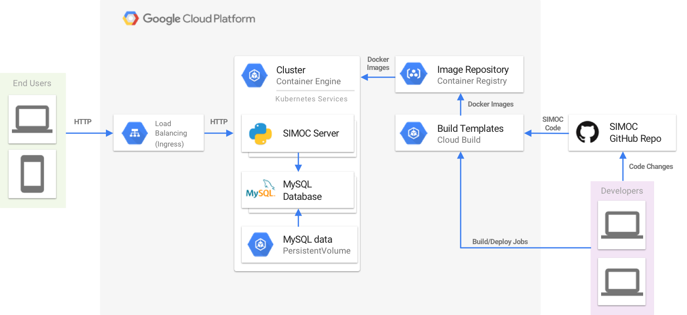

# Introduction
This guide describes the process of deploying SIMOC app to the Google Cloud Platform (GCP) through the following set of steps:
1. Creating a new GCP project
2. Setting up the environment
3. Connecting to the SIMOC GitHub repository
4. Building a SIMOC docker image
5. Spinning up a Kubernetes cluster
6. Deploying SIMOC image to the cluster
7. Accessing the SIMOC app

The guide covers two basic deployment scenarios:
* [Using Google Cloud Shell (Ubuntu environment)](#scenario-1)
* [Deployment from local Linux/macOS](#scenario-2)

# GCP Architecture Diagram


# Configure a GCP project

### 1. Login to the GCP Console
* https://cloud.google.com/

### 2. Make yourself familiar with the GCP Console
* https://console.cloud.google.com/getting-started

### 3. Create a GCP project
* https://cloud.google.com/resource-manager/docs/creating-managing-projects

### 4. Navigate to the API Library
* https://console.cloud.google.com/apis/library

### 5. Activate the following APIs
* Compute Engine API
* Kubernetes Engine API
* Google Cloud Storage
* Cloud Source Repositories API
* Google Container Registry API
* Cloud Build API
* Cloud Key Management Service API

# Scenario 1

## Deploy SIMOC (`using Google Cloud Shell`)

### Initialize a new Cloud Shell session
* https://cloud.google.com/shell/docs/quickstart
* https://console.cloud.google.com/cloudshell

### Select GCP Project and Zone
Check the current configuration:
```bash
gcloud config list
```
Connect to the Project/Zone (if needed):
```bash
gcloud projects list
gcloud compute zones list
gcloud config set project <PROJECT_ID>
gcloud config set compute/zone <GCP_ZONE>
```
Please note your selection as you will need those values later on in this guide.

### Install Helm client tool (`package manager for k8s`)
```bash
curl -o get_helm.sh https://raw.githubusercontent.com/kubernetes/helm/master/scripts/get
chmod +x get_helm.sh
./get_helm.sh
```

### Configure GitHub SSH access
Cloud Build uses personal SSH key to pull the code out of private Github repositories. Your Github account should have access to the private SIMOC repository and your Cloud Shell SSH key should be added to your Github account.

#### 1. Generate a new SSH key (`use empty passphrase`)
```bash
ssh-keygen -t rsa -b 4096 -C "your_email@example.com"
```

#### 2. Copy the content of the `id_rsa.pub` file to your clipboard
```bash
cat ~/.ssh/id_rsa.pub
```

#### 3. Use the following guide starting from the `Step 2` to add the SSH key to your GitHub account
* https://help.github.com/articles/adding-a-new-ssh-key-to-your-github-account/

### Clone the SIMOC codebase
```bash
cd ~/
git clone -b gcp-deployment git@github.com:kstaats/simoc.git
```

### Build SIMOC Image

#### 1. Navigate to the Cloud Build templates folder
```bash
cd ~/simoc/deployment_templates/cloudbuild
```

#### 2. Initialize the Key Management Service:
```bash
gcloud kms keyrings create simoc-keyring --location=global
gcloud kms keys create simoc-github-key \
--location=global --keyring=simoc-keyring \
--purpose=encryption
```

#### 3. Encrypt your SSH key using KMS
```bash
cp ~/.ssh/id_rsa ./
chmod 777 id_rsa
gcloud kms encrypt --plaintext-file=id_rsa \
--ciphertext-file=id_rsa.enc \
--location=global --keyring=simoc-keyring --key=simoc-github-key
rm id_rsa
```

#### 4. Copy Cloud Build service account name
Visit the GCP Console IAM menu and copy the Cloud Build service account email address, which contains `cloudbuild.gserviceaccount.com`
* https://console.cloud.google.com/iam-admin/iam

#### 5. Add Cloud Build `dcrypter` rights
Substitute `<SERVICE_ACCOUNT_NAME>` with the account name you copied at the previous step
```bash
gcloud kms keys add-iam-policy-binding \
    simoc-github-key --location=global --keyring=simoc-keyring \
    --member=serviceAccount:<SERVICE_ACCOUNT_NAME>@cloudbuild.gserviceaccount.com \
    --role=roles/cloudkms.cryptoKeyEncrypterDecrypter
```

#### 6. Create `known_hosts` file
```bash
ssh-keyscan -t rsa github.com > known_hosts
```

#### 7. Submit Cloud Build job (builds SIMOC image)
```bash
gcloud builds submit --config=build_simoc_image_from_github.yaml
```

#### 8. Grand all project users access to the Container Registry
```bash
gsutil iam ch allUsers:objectViewer gs://artifacts.<PROJECT_ID>.appspot.com
```

### Deploy Kubernetes Cluster

#### 1. Open Cloud Shell Code Editor
* https://console.cloud.google.com/cloudshell/editor

#### 2. Open the `~/simoc/deployment_templates/cluster_create.sh` file
Fill in the values for the empty variables and save the file (use secure MySQL password)
```bash
# Fill in the GCP project details (project, zone)
GCP_PROJECT_ID="<GCP_PROJECT_ID>"
GCP_ZONE="<GCP_ZONE>"

# Define the MySQL user password (it will be propagated to the SIMOC server through ENV variables)
MYSQL_USER="proxyuser"
MYSQL_PASSWORD="<MYSQL_PASSWORD>"
MYSQL_DB="proxyuser"
```

#### 3. Open the `~/simoc/deployment_templates/deployments/simoc_server.yaml` file
Fill in the `<PROJECT_ID>` value in the `spec/template/spec/containers/image` section
```bash
image: gcr.io/<PROJECT_ID>/simoc:latest
```

#### 4. Switch back to the Cloud Shell
Run the script to spin up the cluster with the SIMOC image deployed (may take about 5-10 mins to finish)
```bash
cd ~/simoc/deployment_templates
sh cluster_create.sh
```

### Access the SIMOC App
Navigate to the Cloud Kubernetes Services; Once the cluster is up and running (you may need to click a Refresh button a couple of times), the `nginx-ingress-controller` service will list the HTTP/HTTPS Endpoints that you can use to access the app
* https://console.cloud.google.com/kubernetes/discovery

# Scenario 2

## Deploy SIMOC (`from local Linux/macOS`)

### 1. Install and initialize Cloud SDK
* https://cloud.google.com/sdk/
* https://cloud.google.com/sdk/docs/quickstarts

### 2. Install additional SDK components (`k8s client`)
```bash
gcloud components install kubectl
```
### 3. Select GCP Project and Zone
Check the current configuration:
```bash
gcloud config list
```
Connect to the Project/Zone (if needed):
```bash
gcloud projects list
gcloud compute zones list
gcloud config set project <PROJECT_ID>
gcloud config set compute/zone <GCP_ZONE>
```
Please note your selection as you will need those values later on in this guide.

### 4. Install Helm client (`package manager for k8s`)
* https://docs.helm.sh/using_helm/#installing-the-helm-client

### 5. Configure GitHub SSH access
Cloud Build uses personal SSH key to pull the code out of private Github repositories. Your Github account should have access to the private SIMOC repository and your SSH key should be added to your Github account. Use the following guides to make sure you have everything configured:
* https://help.github.com/articles/checking-for-existing-ssh-keys/
* https://help.github.com/articles/generating-a-new-ssh-key-and-adding-it-to-the-ssh-agent/
* https://help.github.com/articles/adding-a-new-ssh-key-to-your-github-account/

### 6. Follow the Cloud Shell instructions starting from the [Clone the SIMOC codebase](#clone-the-simoc-codebase)

# Rollout Updates

### 1. Build a new SIMOC image from GitHub
```bash
cd ~/simoc/deployment_templates/cloudbuild
gcloud builds submit --config=build_simoc_image_from_github.yaml
```

### 2. Deploy the new image to the cluster
```bash
gcloud builds submit --config=deploy_simoc_image.yaml
```
