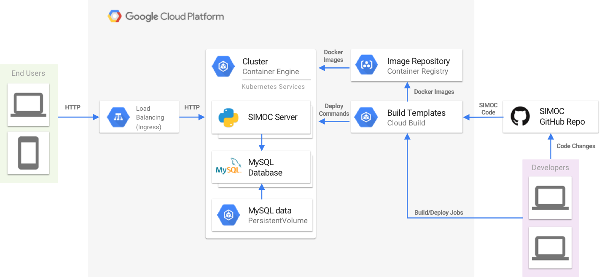

# Deploy `SIMOC` to `Google Kubernetes Engine` (`MySQL` backend)

## Introduction
This guide describes the process of deploying `SIMOC` web application to the `Google Cloud Platform (GCP)` through the following set of steps:
1. Creating a new `GCP` project
2. Setting up the environment
3. Connecting to the `SIMOC` `GitHub` repository
4. Building a `SIMOC` docker images
5. Spinning up a `Kubernetes` cluster
6. Deploying a `SIMOC` to the cluster
7. Accessing the `SIMOC` application

The guide covers two basic deployment scenarios:
* [Using Google Cloud Shell (Ubuntu environment)](#scenario-1)
* [Deployment from local Linux/macOS](#scenario-2)

## Cloud Architecture Diagram (`OUTDATED`)


## Configure a `GCP` Project

### 1. Login to the `Cloud Console`
* https://cloud.google.com/

### 2. Make yourself familiar with the `Cloud Console`
* https://console.cloud.google.com/getting-started

### 3. Create or select a `GCP` project
* https://cloud.google.com/resource-manager/docs/creating-managing-projects

### 4. Make sure that billing is enabled for your project
* https://cloud.google.com/billing/docs/how-to/modify-project

### 5. Navigate to the API Library
* https://console.cloud.google.com/apis/library

### 6. Activate the following APIs
* Compute Engine API
* Kubernetes Engine API
* Google Container Registry API

## Deploy `SIMOC` (using `Cloud Shell`)

### Initialize a new `Cloud Shell` session
* https://cloud.google.com/shell/docs/quickstart
* https://console.cloud.google.com/cloudshell

### Select `GCP` Project and Zone

Make sure you logged in and retrieved the application credentials:
```bash
gcloud auth login
gcloud auth application-default login
```

Check the current configuration:
```bash
gcloud config list
```
Select the `Project` and the `Compute Zone` for the deployment:
```bash
gcloud projects list
gcloud compute zones list
```
```bash
export GCP_PROJECT_ID=<PROJECT_ID>
export GCP_ZONE=<GCP_ZONE>
```

Set up `Project` and `Zone` config:
```bash
gcloud config set project $GCP_PROJECT_ID
gcloud config set compute/zone $GCP_ZONE
```
Please note your selection as you will need those values later on in this guide.

### Install `Helm` client tool (`package manager for k8s`)
```bash
curl https://raw.githubusercontent.com/helm/helm/master/scripts/get-helm-3 > get_helm.sh
chmod 700 get_helm.sh
./get_helm.sh
```

### Register `Helm` repositories
```bash
helm repo add bitnami https://charts.bitnami.com/bitnami
helm repo add stable https://kubernetes-charts.storage.googleapis.com/
helm repo update
```

### Configure `GitHub` `SSH` access

Generate a new `SSH` key (`use empty passphrase`):
```bash
ssh-keygen -t rsa -b 4096 -C "your_email@example.com"
```

Copy the content of the `id_rsa.pub` file to your clipboard:
```bash
cat ~/.ssh/id_rsa.pub
```

Use the following guide starting from the `Step 2` to add the SSH key to your GitHub account:
* https://help.github.com/articles/adding-a-new-ssh-key-to-your-github-account/

### Clone `SIMOC` code from `GitHub`

```bash
cd ~/
git clone git@github.com:kstaats/simoc.git
cd simoc/
```

### Build `SIMOC` images

#### 1. Configure a `Docker` environment
```bash
gcloud auth configure-docker
```

#### 2. Build a `simoc_flask_mysql_k8s` image
```bash
docker build -t simoc_flask_mysql_k8s .
```

#### 3. Build a `simoc_celery_worker_k8s` image
```bash
docker build -f celery_worker/Dockerfile -t simoc_celery_worker_k8s .
```

#### 4. Push images to `Container Registry`
```bash
docker tag simoc_flask_mysql_k8s gcr.io/$GCP_PROJECT_ID/simoc_flask:latest
docker tag simoc_celery_worker_k8s gcr.io/$GCP_PROJECT_ID/simoc_celery:latest
docker push gcr.io/$GCP_PROJECT_ID/simoc_flask:latest
docker push gcr.io/$GCP_PROJECT_ID/simoc_celery:latest
```

### Set up a `Kubernetes` cluster

#### 1. Create a `Kubernetes` cluster
```bash
gcloud container clusters create k0 \
    --enable-ip-alias \
    --create-subnetwork="" \
    --network=default \
    --zone $GCP_ZONE \
    --preemptible \
    --machine-type=n1-standard-4 \
    --num-nodes 2 --enable-autoscaling --min-nodes 2 --max-nodes 5
```

#### 2. Set up a `Kubernetes` environment
```bash
gcloud container clusters get-credentials k0 --zone $GCP_ZONE
```

### Deploy `SIMOC` to `Kubernetes` cluster

#### 2. Deploy `MySQL` server to the cluster
```bash
helm install simoc-db \
    --set mysqlDatabase=simoc \
    --set resources.requests.cpu=1.0 \
    --set resources.requests.memory=512Mi \
    --set resources.limits.cpu=1.0 \
    --set resources.limits.memory=512Mi \
    stable/mysql
```

#### 3. Save the `MySQL` credentials to the `Cloud Secrets`
```bash
export DB_PASSWORD=$(
    kubectl get secret --namespace default simoc-db-mysql -o jsonpath="{.data.mysql-root-password}" | base64 --decode
    echo
)
kubectl create secret generic simoc-db-creds \
    --from-literal=db_password=$DB_PASSWORD
```

#### 4. Deploy `Redis` server to the cluster
```bash
helm install redis stable/redis
```

#### 5. Save the `Redis` credentials to the `Cloud Secrets`
```bash
export REDIS_PASSWORD=$(
    kubectl get secret --namespace default redis -o jsonpath="{.data.redis-password}" | base64 --decode
    echo
)
kubectl create secret generic redis-creds \
    --from-literal=redis_password=$REDIS_PASSWORD
```

#### 6. Create static public IP address for `SIMOC`
```bash
gcloud compute addresses create simoc-static-ip --global
```

#### 7. Update `Kubernetes` manifests
Access the `Code Editor` from the toolbar by clicking the pencil icon:
* https://cloud.google.com/shell/docs/features#code_editor

Open the `~/simoc/k8s/deployments/simoc_flask_server.yaml` file.<br>

Fill in the `<PROJECT_ID>` value in the `spec/spec/containers/image` section:
```bash
image: gcr.io/<PROJECT_ID>/simoc:latest
```

Repeat the same for the `~/simoc/k8s/deployments/simoc_celery_cluster.yaml` file.<br><br>

#### 9. Deploy `SIMOC` backend into the cluster
```bash
kubectl create -f k8s/deployments/flask_server_environment.yaml
kubectl create -f k8s/deployments/celery_cluster_environment.yaml
kubectl create -f k8s/deployments/redis_environment.yaml
kubectl create -f k8s/deployments/simoc_db_environment.yaml
kubectl create -f k8s/deployments/simoc_flask_server.yaml
kubectl create -f k8s/deployments/simoc_celery_cluster.yaml
kubectl create -f k8s/autoscalers/simoc_flask_autoscaler.yaml
kubectl create -f k8s/autoscalers/simoc_celery_autoscaler.yaml
kubectl create -f k8s/ingresses/simoc_backend_config.yaml
kubectl create -f k8s/services/simoc_flask_service.yaml
kubectl create -f k8s/ingresses/simoc_flask_ingress.yaml
```

#### 10. Initialize `MySQL` database
Execute a remote command on `simoc-flask-server` container to initiate a database reset:
```bash
kubectl exec \
    "$(kubectl get pods -l app=simoc-flask-server --output=jsonpath={.items..metadata.name} | cut -d  ' ' -f 1)" \
    -- bash -c "python3 create_db.py"
```

If the following error occurs, wait for 1-2 minutes and retry:
```
error: unable to upgrade connection: container not found ("simoc-flask-server")
```

### Access `SIMOC` web application
In `Cloud Console`, navigate to the `Kubernetes Engine -> Services & Ingress` tab:
* https://console.cloud.google.com/kubernetes/discovery

Once the cluster is up and running (may need to click a `Refresh` button), the `simoc-flask-ingress` service will list the HTTP/HTTPS Endpoints that you can use to access the app.

## Deploy `SIMOC` (from local `Linux/macOS`)

Install and initialize `Cloud SDK`:
* https://cloud.google.com/sdk/
* https://cloud.google.com/sdk/docs/quickstarts

Install additional SDK components (`k8s client`):
```bash
gcloud components install kubectl
```

Follow the `Cloud Shell` instructions starting from the [Select GCP Project and Zone](#select-gcp-project-and-zone)
* Use your favorite text editor and command line terminal to accomplish the steps (instead of Google Cloud Shell and Code Editor)
* Make sure you specify the right path to the `SIMOC` source code folder (default is `$HOME` folder)

## Rollout Updates

### Re-deploy `SIMOC` on file changes

#### 1. Remove exiting `simoc_flask_mysql_k8s` and `simoc_celery_worker_k8s` images (optional)
```bash
docker rmi simoc_flask_mysql_k8s simoc_celery_worker_k8s
```

#### 2. Re-build a `simoc_flask_mysql_k8s` image
```bash
docker build -t simoc_flask_mysql_k8s .
```

#### 3. Re-build a `simoc_celery_worker_k8s` image
```bash
docker build -f celery_worker/Dockerfile -t simoc_celery_worker_k8s .
```

#### 4. Push images to `Container Registry`
```bash
docker tag simoc_flask_mysql_k8s gcr.io/$GCP_PROJECT_ID/simoc_flask:latest
docker tag simoc_celery_worker_k8s gcr.io/$GCP_PROJECT_ID/simoc_celery:latest
docker push gcr.io/$GCP_PROJECT_ID/simoc_flask:latest
docker push gcr.io/$GCP_PROJECT_ID/simoc_celery:latest
```

#### 5. Re-deploy `SIMOC` backend using new images:
```bash
kubectl replace --force -f k8s/deployments/simoc_flask_server.yaml
kubectl replace --force -f k8s/deployments/simoc_celery_cluster.yaml
```

### Reset and re-deploy `MySQL`

Delete the exiting `MySQL` server deployment and credentials:
```bash
helm del --purge simoc-db
kubectl delete secret simoc-db-creds
```

Repeat `Steps 2-3 & 10` from the [Deploy `SIMOC` to `Kubernetes` cluster](#deploy-simoc-to-kubernetes-cluster) section.

